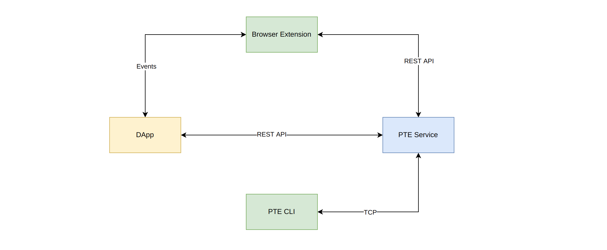

# Babylon Public Test Environment

Babylon Public Test Environment (PTE), a very simple public network simulator that will allow publishing of Scrypto blueprints and components along with composition using the new transaction manifest, with simulator tools sufficient to enable first experimentation with “full stack” dApp development including web front-ends

## PTE Browser Extension

A proof-of-concept browser extension is also provided for accessing the test environment via Chrome.

You can download it from the [latest releases](./todo).

## PTE RESIM CLI

If you've been using `resim`, you may find the PTE CLI tool useful. It provides the same interfaces but talks to the PTE service.

You can download it from the [latest releases](./todo).

## PTE API Specification

You can find the full OpenAPI v3 specification [here](./pte-api-spec/api.yaml).

## PTE Javascript SDKs

For DApp developers, three Typescript/Javascript SDKs are provided:

* `pte-sdk` - An SDK for constructing manifest and interacting with PTE service;
* `pte-wallet-sdk` - An SDK for interacting with PTE browser extension;
* `pte-manifest-compiler` - A library that compiles a manifest into a transaction.

## Example

TBA